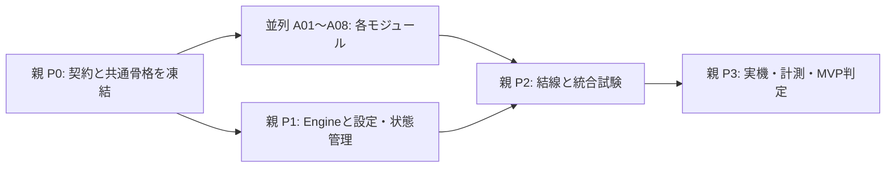

# TickCompare 並列実装Blueprint

基準: [唯一の主要仕様 `spec.md`](../spec.md)、Revision 1.3 / 2026-09-21。本文・Appendix Aを含む全3,280行を読了して分解した。原本SHA-256: `34292C14D28BB9F3E5F6AA895B4B5973F7667A8741F4C7BA8FE81D65A7BB90D0`。

この成果物は設計文書だけである。ソース、Cargo設定、EA、実行可能なテスト、Fixture、実測結果は作成していない。記載したディレクトリは将来の編集権限であり、現在の実装の存在を意味しない。

## 最初に見る担当表

全サブエージェントはP0完了後、他のサブエージェントの実装を待たずに、固定された型・Port・Fixtureと自分のFakeだけで実装・単体検証できる。実機検証と本番モジュールの結線は親に集約する。「契約の準備なしでも完全独立」という意味ではない。

| 担当 | タスク | 作るもの／完了の境界 | 将来の主な編集場所 |
|---|---|---|---|
| 親 | P0 | 補足契約の凍結、共通型、設定schema、テスト期待値、ビルド骨格 | `src/contracts/`, Cargo関連、共通module宣言、`tests/fixtures/` |
| Agent-Wire | A01 | Rustのbinary Codec。Socket処理は含めない | `src/protocol/` |
| Agent-EA | A02 | 2端末で共用するMQL5 EA、回収・cursor・送信・Heartbeat | `mt5/` |
| Agent-Transport | A03 | TCP receiver、受信時刻付与、bounded ingress、ACK送信 | `src/transport/` |
| Agent-Candle | A04 | UTC正規化と固定Slot Candle | `src/tick/normalize.rs`, `src/tick/candle.rs` |
| Agent-Metrics | A05 | Spread・差分・有意Midイベント・1対1matcher | `src/metrics/` の実装ファイル、`src/tick/matcher.rs` |
| Agent-Storage | A06 | bounded非同期binary logger・検証用reader | `src/storage/` |
| Agent-Snapshot | A07 | immutable Snapshot構築・最新値交換 | `src/state/snapshot.rs` |
| Agent-UI | A08 | Snapshotだけを読むegui固定画面 | `src/ui/` |
| 親 | P1 | Engine、2系統の順序統合、状態判定、設定、backpressureの一貫性 | `src/tick/engine.rs`, `src/config.rs`, `src/runtime/` |
| 親 | P2 | 全モジュール結線、起動終了、統合障害試験 | `src/main.rs`, `tests/integration/` |
| 親 | P3 | MT5照合、時刻検証、遅延・負荷・長時間試験、MVP判定 | `tests/system/`, `doc/validation/` |

タスクの入力・出力・編集権限・依存・完了条件・テスト・禁止事項は、[tasks.md](tasks.md)にすべて定義する。この表だけを渡して実装を開始しない。

## 読む順序と契約の優先順位

1. `spec.md`と[invariants.md](invariants.md): 変更禁止の前提。
2. [decisions.md](decisions.md): 原仕様の不足・矛盾と、本Blueprintの補足判断。
3. [architecture.md](architecture.md)と[interfaces.md](interfaces.md): 所有者、Port、データ型。
4. [wire-format.md](wire-format.md): MQL5/Rust間の実装契約。
5. [semantics-tick.md](semantics-tick.md)、[semantics-candle.md](semantics-candle.md)、[semantics-lead-lag.md](semantics-lead-lag.md)、[semantics-snapshot.md](semantics-snapshot.md)。
6. 保存担当・親は[storage-format.md](storage-format.md)。全担当は[tasks.md](tasks.md)の担当節と[validation.md](validation.md)。

文中のラベル:

| ラベル | 意味 |
|---|---|
| S | `spec.md`に明記された仕様。節番号を出典として示す |
| B / D番号 | 並列実装のために本Blueprintが選んだ補足契約。原仕様の記載であるとは主張しない |
| V | 実端末・実測でしか確認できない事項。文書作成で検証済みにしない |

主仕様と衝突した場合、担当者が片側を勝手に採用してはならない。親がD番号に記録して契約を修正し、影響タスクへ同じrevisionを配る。原仕様を変更する必要がある判断は独断で実装しない。本Blueprintの補足は主仕様を置き換えない。

## 実行順序

親を含め同時4枠なら、P0後にA01/A02/A03、次にA04/A05/A06、次にA07/A08を割り当てる。親はその間P1を進める。これは資源上の順番であり、A07がA04の実装待ち、A08がA07の実装待ちという依存ではない。空き枠があればどのAタスクも先に着手できる。

P0は「あとで各担当が相談する」という未定状態を残さず、D01〜D22の補足契約、共有型、Fixtureを固定する。EAの同一ms走査限界とUTC基準の実端末確認はVとして追跡する。テストFakeによる開発は進められるが、実機確認前にlossless運用・正しいUTC・低遅延を達成したと宣言してはならない。
