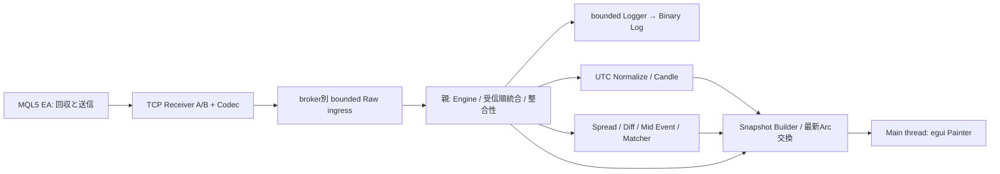

# モジュール境界と所有権

出典: 主仕様§4, §22–26, §50–54, §90。追加境界はB/D08,D14,D17,D21,D22。

## 処理境界

Raw ingressとLoggerはfullならbackpressure。Snapshot交換は古い未表示Snapshotを置換可能。health mailboxは別系統で、最新faultと累積件数をEngine停止中も取得できる。Raw Tickをhealth mailboxへ逃がして捨てる使い方は禁止。

| 境界 | 自分が所有する状態 | 入出力 | 他の状態へ直接アクセスしない |
|---|---|---|---|
| MQL5 EA | session、cursor、seq、pending bytes、phase、診断 | CopyTicks → wire、ACK受信 | RustのCandle/Lead/UI |
| Codec | 境界未完成のbyte buffer、decode診断 | bytes ↔ Frame | Socket、時計、sessionの業務状態 |
| Transport | socket lifecycle、frame採時、bounded送出待ち、watermark | Frame → IngressItem、Control → bytes | Candle・matcher、Loggerファイル |
| Engine | session/seq ledger、merge buffer、analysis segment、latest quote、health、bounded履歴 | Ingress → LogRecord/分析Port/Projection | UI描画、直接disk I/O |
| Normalize/Candle | 正規化設定epoch、broker別Slot cache | Tick/UTC clock → NormalizedTick/Slot更新 | rx時計でSlotを作ること |
| Metrics/Matcher | quote state、anchors、cooldown、未対応イベント、EMA | ordered Tick/Event → Metrics/Match | TCP、offset推定、UI |
| Storage | ファイル、buffer、追記/flush状態 | LogRecord → accepted/durable/fault | 分析値の改変、UI、Cursor |
| Snapshot | immutable chunks、snapshot revision、publish交換場所 | Projection → Arc snapshot | Raw Tick採否、分析ルール |
| UI | 現在Arc、表示設定・局所描画状態 | Snapshot → Painter | broker quoteやCandleの再計算 |

## スレッドと時刻

- Main: egui/eframe。snapshot読取と描画、終了要求のみ。
- Receiver A/B: listener、socket I/O、Codec、共通Clockの採時。2つとも同一`RunId + Instant origin`を使用。
- Engine: 1 writer。受信順統合、整合性、Candle/Metrics。各分析Portは同期純粋処理で、別threadを内部生成しない。
- Logger: 1 worker。buffered I/O。
- Publish/health coordinator: 親のruntime。通常はEngineの最新Projectionを上限repaint_hzでSnapshot化する。EngineがLogger待ちでもtimer/health更新とUIへの公開を継続できるよう、Engineの最新immutable Projectionを受け取る小さな別workerとする（B）。高負荷時に分析進捗を捏造しない。

主仕様§23は基本構成であり、最後のworkerは§25,§52,§72の同時成立のための補足。UI threadへ処理を移す代案は採らない。

## 2Receiverの順序統合（親P1）

各Receiverは有効な完全frameをdecodeした直後に`rx_mono_ns`を1回採時し、`frame_index`を付ける。queue fullの待ち時間をこの受信時刻へ足さない。同じframeの全Tickは同じ時刻を継承する。

brokerごとのFIFOへFrameと`Progress(watermark_ns)`を送る。Progressは「この値未満の時刻を持つFrameはすべてこのFIFOへ送出済み」を意味する。fullで保持中の完全Frameがあれば、その時刻を越えるwatermarkを発行しない。idle時はtimerでProgressを送れる。未完成frameの時刻はまだ存在しないため、将来の完成・採時値はそのProgress以上になる。

Engineは両方の有効watermarkの最小値をWとし、`rx_mono_ns < W`のFrameを`(rx_mono_ns, broker_id, connection_generation, frame_index)`順に確定して処理する。同一frame内はsequence順。等しいrx時刻のtie-breakは再現性のためであり、Lead/Lagの正の時間差を創作しない。正常切断は、それ以前のFrameを送出してからEndを送り、そのgenerationをmerge待ち対象から外す。未接続brokerは待ち対象に含めない。再接続は新generationと現在の共通clockから始める。

watermark遅延・queue待ちによって解析確定が遅れても、受信時計をEngine処理時刻に置換しない。受信→確定遅延を診断する。Progress周期初期1msはスケジューラの保証ではなく測定対象。片側の送出が詰まればRaw順序を守ってbackpressureし、healthを別経路で公開する。finite merge容量はingress容量の予算内に含める。

## 保存と障害境界

EngineはFrameの構造検証とsession/sequence分類後、観測したraw Frameと診断をLoggerへ渡す。Logger queueが受理してから、新規の分析可能Tickを分析Portへ送る。再送重複・異常値もraw observationとして保存し、分析対象かを別フィールドにする。ACKはこの永続化完了を意味しない。

Logger queue full → Engineがpendingを保持 → ingress full → Receiverがread抑制 → TCP backpressure → EA有限pending、の順で伝播する。UIは最後の分析結果＋新しいOVERLOAD/statusを描く。EA容量超過のDATA_LOSS、short write後切断のUNCONFIRMED、disk faultの未永続化を同じ「成功」に丸めない。

診断保存先まで故障した場合、GUI/標準診断出力/累積counterでfaultを残し、保存できたと主張しない。全障害で永久にlosslessという保証はしない。

## 将来のファイル所有権

主仕様§22の構造を基本に、共有契約とruntimeを追加する。

| owner | 独占パス |
|---|---|
| P0/P1/P2 親 | `Cargo.toml`, `Cargo.lock`, `src/main.rs`, `src/lib.rs`, `src/config.rs`, `src/contracts/**`, `src/runtime/**`, `src/tick/mod.rs`, `src/tick/engine.rs`, `src/metrics/mod.rs`, `src/state/mod.rs`, `tests/fixtures/**`, `tests/support/**`, `tests/integration/**`, `tests/system/**`, `config/**`, `doc/validation/**` |
| A01 | `src/protocol/**`, `tests/protocol/**` |
| A02 | `mt5/**`, `tests/ea/**` |
| A03 | `src/transport/**`, `tests/transport/**` |
| A04 | `src/tick/normalize.rs`, `src/tick/candle.rs`, `tests/candle/**` |
| A05 | `src/metrics/spread.rs`, `src/metrics/price_diff.rs`, `src/metrics/lead_lag.rs`, `src/tick/matcher.rs`, `tests/metrics/**` |
| A06 | `src/storage/**`, `tests/storage/**` |
| A07 | `src/state/snapshot.rs`, `tests/snapshot/**` |
| A08 | `src/ui/**`, `tests/ui/**` |

各Aタスクは`doc/implementation-reports/Axx.md`だけ追加の報告先として編集可。原仕様、Blueprint、他担当のテスト期待値、共通型、root manifestは読み取り専用。新依存や契約修正は親へ差分提案し、親が反映してrevisionを上げる。子同士で共通ファイルを共同編集しない。

P0はテストdirectoryの自動検出を仮定せず、専用test target/module登録と個別の実行方法を用意する。未完成兄弟moduleのため単体testがビルド不能にならないfeature分離またはテストharnessを親が用意する。
